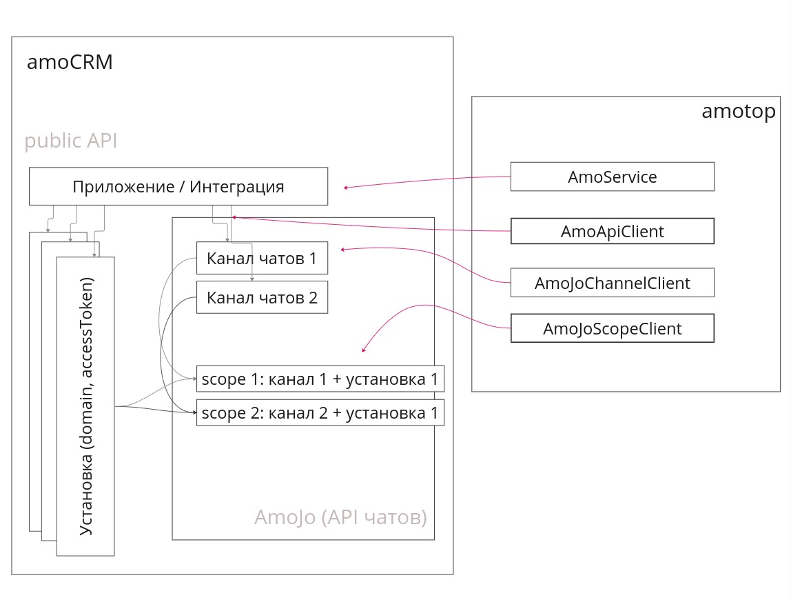

# @mobilon-dev/amotop

@mobilon-dev/amotop - еще один amoCRM API клиент для node.js

- [Репозиторий](https://github.com/mobilon-dev/amotop)

- [Документация](https://mobilon-dev.github.io/amotop/)

- [Примеры](samples/index.md)


## Видео

- [Видео: Знакомство с @mobilon-dev/amotop](https://youtu.be/zRlO7e41bwg)

- [Видео: amoCRM oAuth 2.0](https://youtu.be/CxQcB5AsyHI)

- [Видео: amoCRM chat API](https://youtu.be/f31UVtn7EJI)

- [Видео: amoCRM file API](https://youtu.be/3DLbkBt7kHw)


## Зачем?

Простой клиент-обертка на API amoCRM, чтобы помочь коллеге быстро разобраться с концепцией amoCRM и начать приносить пользу.


## Преимущества

- Прост в понимании, легок в использовании

- Логирует все запросы (request/responsе)

- Работает с API чатов amoCRM


## Установка

`````
npm i @mobilon-dev/amotop

`````

## Использование

`````javascript

const {AmoJoScopeClient, AmoApiClient} = require('@mobilon-dev/amotop');

const {debug, scopeId, channelSecret, domain, accessToken} = require('../_config');

const amoJoScopeClient = new AmoJoScopeClient({scopeId, channelSecret, debug});
const amoApiClient = new AmoApiClient(domain, accessToken, {debug});

// получаем сделки
const leads = await amoApiClient.getLeads({limit: 20});

// отправляем сообщение в чат
const response = await amoJoScopeClient.sendMessage(message);

/*
логи

[AmoApiClient][Request] GET https://mobilonchatitest6.amocrm.ru/api/v4/leads?page=1&limit=20
[AmoApiClient][Response] GET https://mobilonchatitest6.amocrm.ru/api/v4/leads?page=1&limit=20 200:OK {"_page":1,"_links":{"self":{"href":"https://mobilonchatitest6.amocrm.ru/api/v4/leads?page=1&limit=20"}},"_embedded":{"leads":[{"id":4214965,"name":"Продать стул","price":10000,"responsible_user_id":886363,"group_id":0,"status_id":64831342,"pipeline_id":7883550,"loss_reason_id":null,"created_by":886363,"updated_by":886363,"created_at":1709609319,"updated_at":1709692894,"closed_at":null,"closest_task_at":null,"is_deleted":false,"custom_fields_values":null,"score":null,"account_id":31612010,"labor_cost":null,"_links":{"self":{"href":"https://mobilonchatitest6.amocrm.ru/api/v4/leads/4214965?page=1&limit=20"}},"_embedded":{"tags":[],"companies":[]}}]}}

*/
`````

## Концепция



### AmoService (domain)

- для обмена токенов

### AmoApiClient (domain, accessToken)

- для взаимодействия с AmoCRM API

### AmoFileClient (accessToken)

- для взаимодействия с File API AmoCRM

### AmoJoChannelClient (channelId, channelSecret)

- для работы с каналом Чат API AmoCRM: создавать/удалять подключения

### AmoJoScopeClient (scopeId, channelSecret)

- для работы с конкретным подключением чата к интеграции Чат API AmoCRM


## amoCRM API

[amo API](https://www.amocrm.ru/developers/content/crm_platform/api-reference)

[chat API](https://www.amocrm.ru/developers/content/chats/chat-api-reference)

[files API](https://www.amocrm.ru/developers/content/files/files-capabilities)
